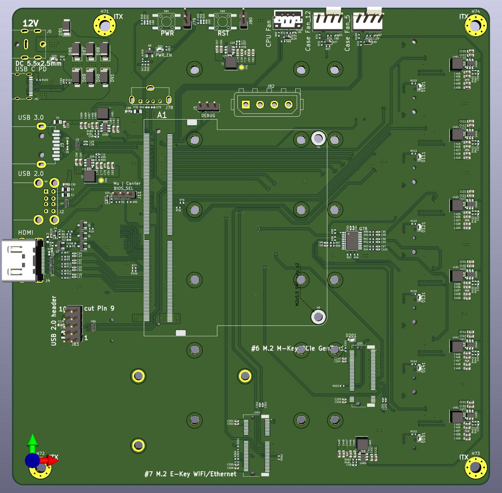
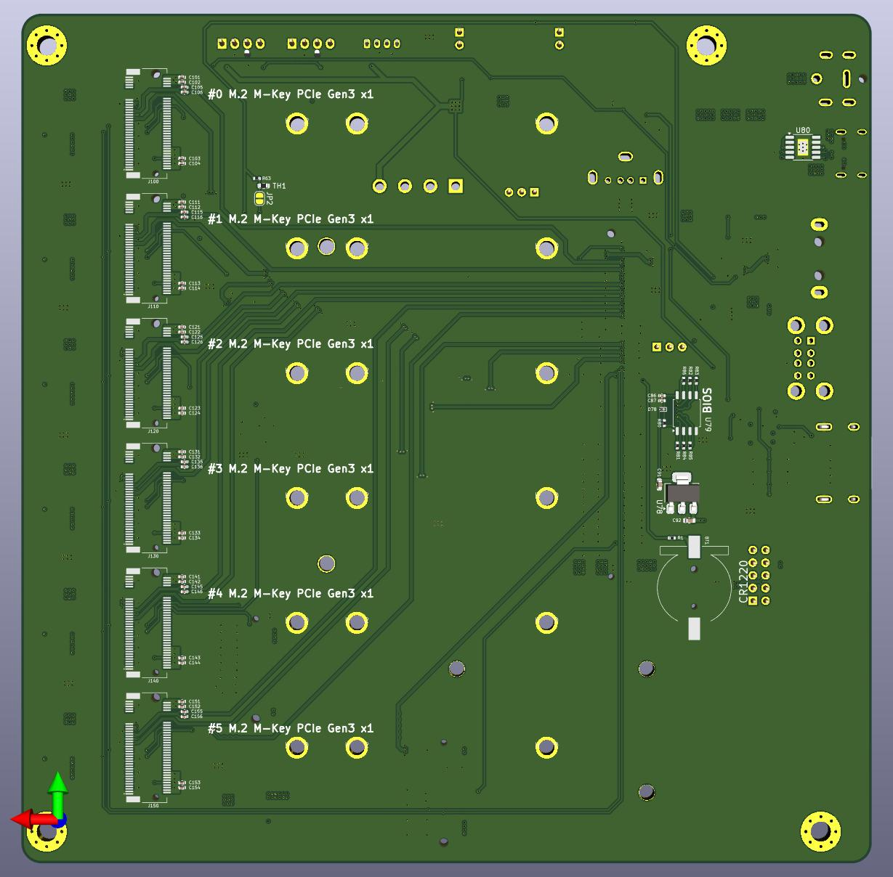

# nvme Carrier for LattePanda Mu

## Specification

### Power Input

- DC 5.5x2.5mm: 12V (Max 10A)
- USB-C 15V

### Internal Interfaces

- 1x M.2 M Key 2242 & 2280 (PCIe 3.0 x1) on the frontside
- 1x M.2 E Key 2242 (PCIe 3.0 x1) on the frontside
- 6x M.2 M Key up to 2280 (PCIe 3.0 x1) on the backside
- RTC battery socket (CR1220 3V)
- CPU fan socket
- 2x CASE fan socket (1x only when using 12V)
- 3x USB 2.0 (1x USB Port)
- MOLEX Connector for 5V (2A) and 12V Supply to HDDs (only when using 12V)

### External Interfaces

- 1x USB 3.2 10Gbps
- 2x USB 2.0
- HDMI 2.0

### Dimension

ITX, 170mm×170mm

### Extras

Carrier BIOS
