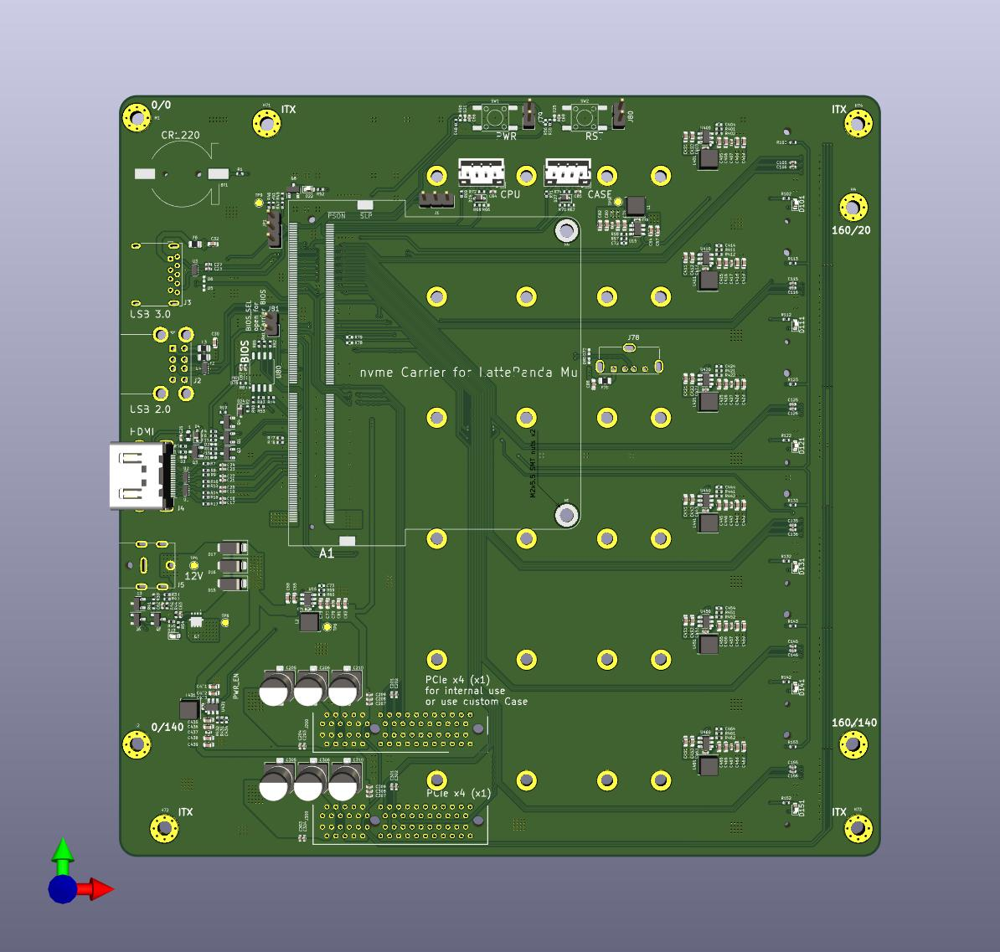
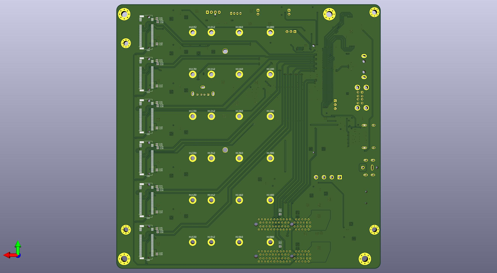

# nvme Carrier for LattePanda Mu

## Specification

### Power Input

- DC 5.5x2.5mm: 12V (Max 10A)

### Internal Interfaces

- 2x PCIe 3.0 x4 (x1 electrical) slot
  - one for user-selected network card
  - one for SATA controller, for example
- 6x M.2 M Key up to 2280 (PCIe 3.0 x1)
- RTC battery socket (CR1220 3V)
- CPU fan socket
- CASE fan socket
- 1x USB 2.0
- MOLEX Connector for 5V (2A) and 12V Supply to HDDs

### External Interfaces

- 1x USB 3.2 10Gbps
- 2x USB 2.0
- HDMI 2.0

### Dimension

ITX, 170mm×170mm

### Extras

Carrier BIOS
